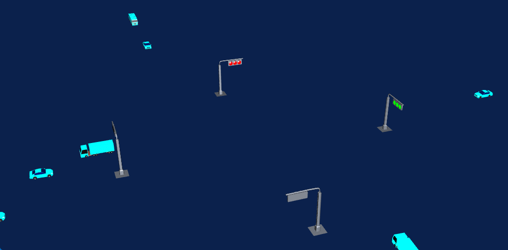

✨ Fullstack Web Developer | Open Source Enthusiast | Building Practical Tools

---

## 🛠️ Tech Stack

**Frontend**  

**Backend**  

**Database & Tools**  

---

## 📂 Featured Projects

---
### 1. 🔗 Orthogonal Edge Routing Algorithm for Topology Editor

**Description**  
Inspired by editors like DrawIO, this project tackles orthogonal edge routing and automatic obstacle avoidance. It generates discrete points using a grid-based approach, computes shortest paths with A* and Dijkstra, and uses algorithm visualization to debug geometric errors. The result is a reusable orthogonal edge routing module that enhances interactive graph editing.

**Tech Stack**  

**📝 [Technical Notes](https://blog.csdn.net/xwstudysoft/article/details/157542583)**

---

### 2. 🌍 Mars Terrain Quadtree Visualization System

**Description**  
Processes Mars elevation data (Mars_HRSC_MOLA_BlendDEM) with GDAL, builds a LOD pyramid and tile structure, and renders global terrain in the browser using Three.js + quadtree. Features include orthographic/perspective projection switching, custom shading, concurrent tile loading (PriorityQueue + Web Worker), pole hole correction, and geospatial annotations. This project provides comprehensive experience for large‑scale GIS visualization applications.

**Tech Stack**  

**📝 [Development Notes](https://blog.csdn.net/xwstudysoft/article/details/157645035)**
**📽️ [Video Demo](https://www.bilibili.com/video/BV1YXAqzpEEN/?spm_id_from=333.1387.list.card_archive.click&vd_source=3434557e40e288ad9d728f42946fbf4b)**

---
### 3. 🖼️ High‑Resolution Image Rendering with Quadtree + LOD

**Description**  
To address performance issues with Canvas rendering 4K+ images in a company project, this solution implements dynamic resolution using a quadtree + LOD approach. It enables smooth rendering of images larger than 8K in a Canvas viewport, effectively solving a real‑world business bottleneck while deepening understanding of spatial indexing and GPU sampling optimization.

**Tech Stack**  

---

### 4. 📊 HelloVulkan — Vulkan Learning & Wrapper

**Description**  
Systematically studied the official Vulkan tutorial and wrapped a glb/obj model renderer, gaining control over presentation and multiple pipelines. As a frontend developer, this project expanded my knowledge of low‑level graphics, laying a foundation for future high‑performance graphics applications.

**Tech Stack**  

**🔗 [GitHub Repository](https://github.com/wxzen/HelloVulkan.git)**

---

### 5. 🚀 CesiumNative + OpenGL 3DTiles Renderer

**Description**  
Integrated `cesium-native` with OpenGL 3.3 and ImGui in two weeks, implementing 3DTiles and ellipsoid rendering. This project filled a gap from previous work and provided deep insight into the OpenGL pipeline and underlying graphics technologies.

**Tech Stack**  

**🔗 [Live Demo](https://www.bilibili.com/video/BV1hURqYTEQy/)**

---

### 6. 🎮 godot-3dtiles — Godot Engine 3DTiles Plugin

**Description**  
Integrates Cesium Native into the Godot engine, enabling loading and rendering of 3DTiles data. Using GDExtension, the plugin wraps the underlying C++ interfaces to provide high‑precision 3D geospatial data visualization within Godot.

**Tech Stack**  

**🔗 [GitHub Repository](https://github.com/wxzen/godot-3dtiles)**

---

### 7. 🚦 3D Traffic Intersection Simulation

**Description**  
A dynamic simulation system for urban traffic intersections built on real GIS data. Implements vehicle path planning, traffic light control logic, and multi‑view navigation, suitable for traffic scenario analysis and smart city presentations.

**Tech Stack**  

---

## 📬 Contact Me

- Email: [xuwzen@outlook.com](mailto:xuwzen@outlook.com)