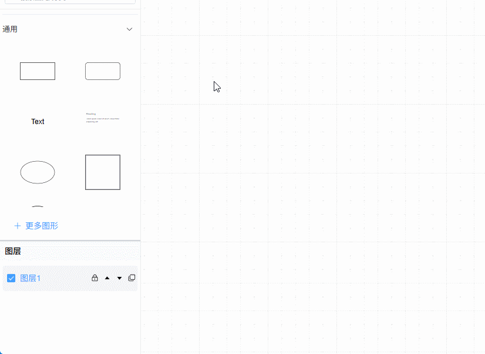
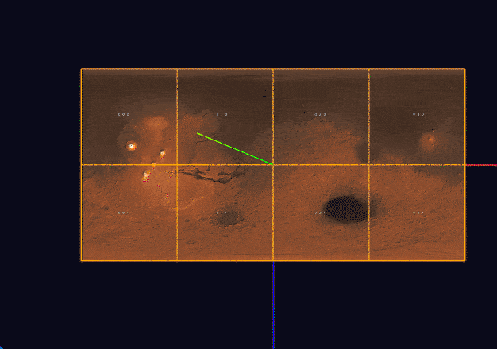
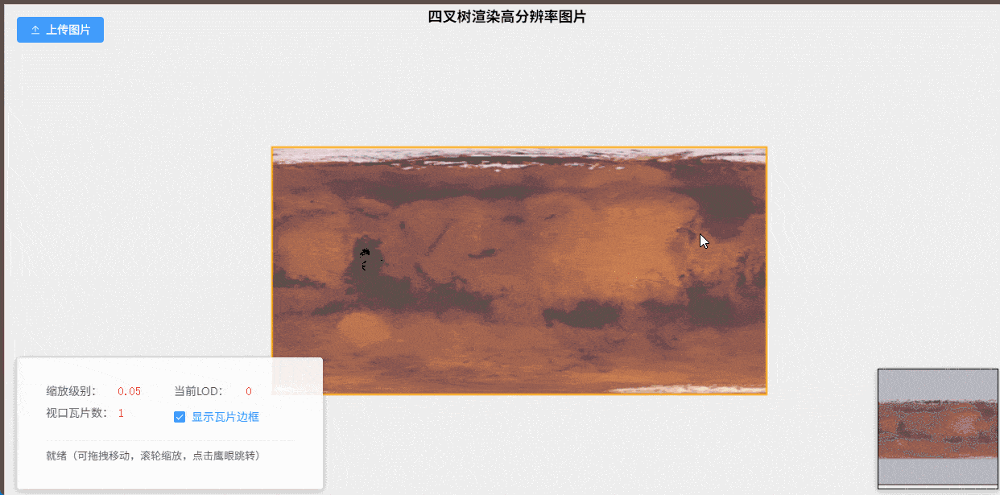
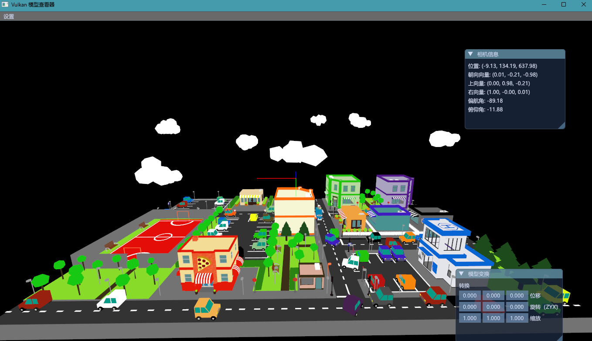
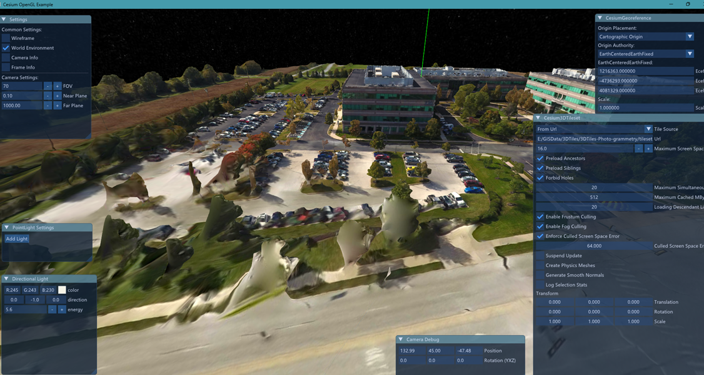
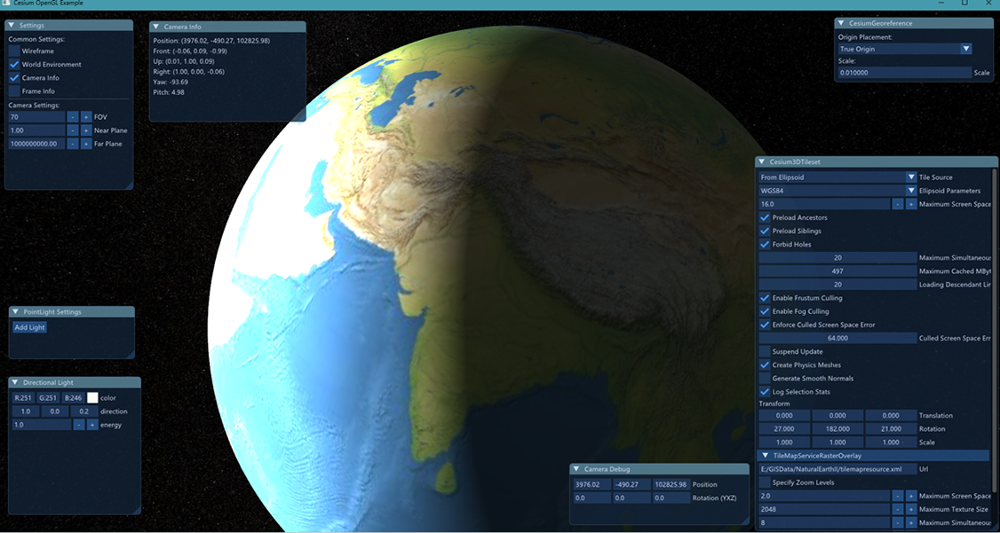
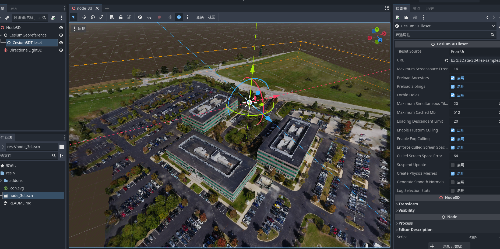

✨ Fullstack Web Developer | 10 Years of Experience | Open Source Enthusiast | Building Practical Tools

---

## 🚀 Core Strengths

- **10 years** of web development experience, with the last **6 years focused on frontend & Web3D visualization, digital twins, and WebGIS**
- Familiar with Vue/React, TypeScript, with experience in complex project engineering, componentization, and performance optimization
- Solid understanding of Three.js, CesiumJS, WebGL — experienced in massive data rendering, LOD scheduling, topology algorithms, and geospatial visualization
- Experience with C++/OpenGL/CMake, capable of extending 3D engines, developing native plugins, and optimizing performance with WebAssembly
- Independently lead full project lifecycles: solution design, architecture setup, core development, performance tuning, and delivery

---

## 🛠️ Core Skills

**Frontend Ecosystem**  

**Visualization & GIS**  

**Graphics & Low‑Level**  

**Tools & Engineering**  

---

## 💼 Experience

A seasoned fullstack developer with **10 years of professional experience**, transitioning from traditional Java web development to **frontend visualization and 3D graphics**. Over the past 6 years, I have focused on Web3D, digital twins, and WebGIS — leading architecture design, core development, and performance optimization for complex visualization platforms. I have successfully delivered projects in smart grid inspection, intelligent transportation, environmental monitoring, and geospatial data visualization, and have also built several self‑driven projects to deepen expertise in 3D engines, pathfinding algorithms, and large‑scale terrain rendering.

---

## 📂 Featured Projects

### 1. 🔗 Orthogonal Edge Routing Algorithm for Topology Editor

**Description**  
Inspired by editors like DrawIO, this project tackles orthogonal edge routing and automatic obstacle avoidance. It generates discrete points using a grid‑based approach, computes shortest paths with A* and Dijkstra, and uses algorithm visualization to debug geometric errors. The result is a reusable orthogonal edge routing module that enhances interactive graph editing.

**Tech Stack**  

**📝 [Technical Notes](https://blog.csdn.net/xwstudysoft/article/details/157542583)**

---

### 2. 🌍 Mars Terrain Visualization System

**Description**  
A planetary‑scale terrain visualization system built with Vue3 + TypeScript + Three.js. Implements quadtree‑based LOD tile scheduling, dual projection switching (orthographic/perspective), and asynchronous computation via Web Workers. Achieves LCP 489ms, INP 45ms, CLS 0, and a stable 60fps, supporting high‑precision terrain roaming and geospatial search.

**Tech Stack**  

**📝 [Development Notes](https://blog.csdn.net/xwstudysoft/article/details/157645035)**
**📽️ [Video Demo](https://www.bilibili.com/video/BV1YXAqzpEEN/)**

---

### 3. 🖼️ High‑Resolution Image Rendering with Quadtree + LOD

**Description**  
To address performance issues with Canvas rendering 4K+ images in a company project, this solution implements dynamic resolution using a quadtree + LOD approach. It enables smooth rendering of images larger than 8K in a Canvas viewport, effectively solving a real‑world business bottleneck while deepening understanding of spatial indexing and GPU sampling optimization.

**Tech Stack**  

---

### 4. 📊 HelloVulkan — Vulkan Learning & Wrapper

**Description**  
Systematically studied the official Vulkan tutorial and wrapped a glb/obj model renderer, gaining control over presentation and multiple pipelines. As a frontend developer, this project expanded my knowledge of low‑level graphics, laying a foundation for future high‑performance graphics applications.

**Tech Stack**  

**🔗 [GitHub Repository](https://github.com/wxzen/HelloVulkan.git)**

---

### 5. 🚀 CesiumNative + OpenGL 3DTiles Renderer

**Description**  
Integrated `cesium-native` with OpenGL 3.3 and ImGui in two weeks, implementing 3DTiles and ellipsoid rendering. This project filled a gap from previous work and provided deep insight into the OpenGL pipeline and underlying graphics technologies.

**Tech Stack**  

**🔗 [Live Demo](https://www.bilibili.com/video/BV1hURqYTEQy/)**

---

### 6. 🎮 godot-3dtiles — Godot Engine 3DTiles Plugin

**Description**  
Integrates Cesium Native into the Godot engine, enabling loading and rendering of 3DTiles data. Using GDExtension, the plugin wraps the underlying C++ interfaces to provide high‑precision 3D geospatial data visualization within Godot.

**Tech Stack**  

**🔗 [GitHub Repository](https://github.com/wxzen/godot-3dtiles)**

---
### 7. ⚡ 3D Power Grid Inspection System

**Description**  
A digital twin platform built with Vue2 + CesiumJS for power grid inspection. Features smooth loading of massive oblique photogrammetry data, UAV flight path planning, and video fusion, significantly improving on‑site inspection efficiency.

**Tech Stack**  

---

### 8. 🌫️ Air Quality Monitoring Platform with Spatial Interpolation

**Description**  
An environmental monitoring platform implementing dynamic visualization of meteorological fields using IDW (Inverse Distance Weighting) and Kriging interpolation algorithms. Performance optimized with Web Workers and WebAssembly for smooth frontend rendering. Also includes a multi‑threaded data crawler to ensure data integrity and collection efficiency.

**Tech Stack**  

**📝 Technical Blogs**  
- [Inverse Distance Weighting (IDW) Deep Dive](https://www.cnblogs.com/davidxu/p/12817096.html)  
- [Bilinear Interpolation Explained](https://www.cnblogs.com/davidxu/p/13764587.html)  
- [Kriging Interpolation Deep Dive](https://www.cnblogs.com/davidxu/p/14223934.html)

**🔗 [GitHub Repository](https://github.com/wxzen/jcontour)** — Java implementation of IDW, Kriging, and contour topology drawing

---

### 9. 🚦 3D Traffic Intersection Simulation

**Description**  
A dynamic simulation system for urban traffic intersections built on real GIS data. Implements vehicle path planning, traffic light control logic, and multi‑view navigation, suitable for traffic scenario analysis and smart city presentations.

**Tech Stack**  

---

## 🎓 Education

**Anhui Agricultural University**  
Bachelor of Information Management and Information Systems  
*2011 – 2015*

---

## 📬 Contact Me

- Email: [xuwzen@outlook.com](mailto:xuwzen@outlook.com)
- GitHub: [github.com/wxzen](https://github.com/wxzen)